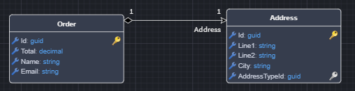
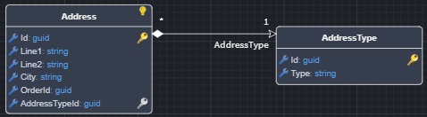

# Intent C# Metadata Synchronizer

The Intent C# Metadata Synchronizer CLI tool can be used to synchronize your `cs` files into an Intent Architect Domain package.

This tool can be useful for creating Intent Architect Domain Packages based on your C# Class `cs` files.

## Pre-requisites

Latest release version of [.NET](https://dotnet.microsoft.com/download).

## Installation

The tool is available as a [.NET Tool](https://docs.microsoft.com/dotnet/core/tools/global-tools) and can be installed with the following command:

```powershell
dotnet tool install Intent.MetadataSynchronizer.CSharp.CLI --global --prerelease
```

> [!NOTE]
> If `dotnet tool install` fails with an error to the effect of `The required NuGet feed can't be accessed, perhaps because of an Internet connection problem.` and it shows a private NuGet feed URL, you can try add the `--ignore-failed-sources` command line option ([source](https://learn.microsoft.com/dotnet/core/tools/troubleshoot-usage-issues#nuget-feed-cant-be-accessed)).

You should see output to the effect of:

```text
You can invoke the tool using the following command: intent-csharp-metadata-synchronizer
Tool 'intent.metadatasynchronizer.csharp.cli' (version 'x.x.x') was successfully installed.
```

## Usage

`intent-csharp-metadata-synchronizer [options]`

### Options

| Option                                  | Description                                                                                                                                                                                                                                                                     |
|-----------------------------------------|---------------------------------------------------------------------------------------------------------------------------------------------------------------------------------------------------------------------------------------------------------------------------------|
| `--config-file <config-file>`           | Path to a [JSON formatted file](#configuration-file) containing options to use for execution of this tool as an alternative to using command line options. The `--generate-config-file` option can be used to generate a file with all the possible fields populated with null. |
| `--generate-config-file`                | Scaffolds into the current working directory a "config.json" for use with the `--config-file` option.                                                                                                                                                                           |
| `--isln-file <isln-file>`               | The Intent Architect solution (.isln) file containing the Intent Architect Application into which to synchronize the metadata.                                                                                                                                                  |
| `--domain-entities-folder`              | This folder location will be used to sync the C# Classes/Records contained within it as Domain Entities.                                                                                                                                                                        |
| `--domain-enums-folder`                 | This folder location will be used to sync the C# Enums contained within it as Domain Enums.                                                                                                                                                                                     |
| `--domain-services-folder`              | This folder location will be used to sync the C# Classes/Records contained within it as Domain Services.                                                                                                                                                                        |
| `--domain-repositories-folder`          | This folder location will be used to sync the C# Classes/Records contained within it as Domain Repositories.                                                                                                                                                                    |
| `--domain-data-contracts-folder`        | This folder location will be used to sync the C# Classes/Records contained within it as Domain Data Contracts.                                                                                                                                                                  |
| `--service-dtos-folder`                 | This folder location will be used to sync the C# Classes/Records contained within it as Service DTOs.                                                                                                                                                                           |
| `--service-enums-folder`                | This folder location will be used to sync the C# Classes contained within it as Service Enums.                                                                                                                                                                                  |
| `--value-objects-folder`                | This folder location will be used to sync the C# Classes/Records contained within it as Value Objects.                                                                                                                                                                          |
| `--event-messages-folder`                | This folder location will be used to sync the C# Classes/Records contained within it as Eventing Messages or Eventing DTOs.                                                                                                                                                                          |
| `--application-name <application-name>` | The name of the Intent Architect Application (as per the Application Settings view) containing the Intent Architect Package into which to synchronize the metadata.                                                                                                             |
| `--package-id <package-id>`             | The id of the Intent Architect Package containing the Intent Architect Package into which to synchronize the metadata.                                                                                                                                                          |
| `--designer-name <designer-name>`       | The name of the Designer where the package is located. i.e. "Domain" or "Services". Defaults to "Domain".                                                                                                                                                                       |
| `--target-folder-id <target-folder-id>` | The target folder within the Intent Architect package into which to synchronize the metadata. If unspecified then the metadata will be synchronized into the root of the Intent Architect package.                                                                              |
| `--allow-removal <bool>`                | Remove previously imported data which is no longer being imported?                                                                                                                                                                                                              |
| `--version`                             | Show version information                                                                                                                                                                                                                                                        |
| `-?`, `-h`, `--help`                    | Show help and usage information                                                                                                                                                                                                                                                 |

### Configuration file

The `--config-file` option expects the name of a file containing configuration options to be used as an alternative to adding them as CLI options. A template for the configuration file can be generated using the `--generate-config-file` option. The content of the generated template is as follows:

```json
{
  "DomainEntitiesFolder": null,
  "DomainEnumsFolder": null,
  "DomainServicesFolder": null,
  "DomainRepositoriesFolder": null,
  "DomainDataContractsFolder": null,
  "ServiceEnumsFolder": null,
  "ServiceDtosFolder": null,
  "ValueObjectsFolder": null,
  "EventMessagesFolder" : null,
  "IslnFile": null,
  "ApplicationName": null,
  "PackageId": null,
  "DesignerName": null,
  "TargetFolderId": null,
  "AllowRemoval": true
}
```

## Domain Synchronization

Bear in mind, that the `Metadata Synchronizer` will make a **_best effort_** to determine keys and relationships based on the classes provided. If incorrect, the generated model can be manually edited to obtain the desired result.

### Primary Keys

When importing entities into the `Domain` (by specifying a value for _DomainEntitiesFolder_ with the _PackageId_ and _DesignerName_ referencing a package in the `Domain Designer`) the `Primary Key` on imported entities will be set based on the following configuration/conventions:

- **The `Key` attribute**: if a property on the entity has the `Key` attribute it will be marked as a `Primary Key`:

  ``` csharp
  public class Product
  {
    // this will be marked as the primary key in the Domain Designer in Intent Architect once imported
    [Key]
    public Guid Id {get; set;}

    public string Name {get; set;}
  }
  ```

- **Property named `Id`**: if a property on the entity is named `Id` it will be marked as a `Primary Key` (even without the `Key` attribute)

  ``` csharp
  public class Product
  {
    // this will be marked as the primary key in the Domain Designer in Intent Architect once imported
    public Guid Id {get; set;}

    public string Name {get; set;}
  }
  ```

- **Property named `{ClassName}Id`**: if a property on the entity is named `{ClassName}Id` it will be marked as a `Primary Key` (even without the `Key` attribute)

  ``` csharp
  public class Product
  {
    // this will be marked as the primary key in the Domain Designer in Intent Architect once imported
    // as it is {ClassName}Id.
    public Guid ProductId {get; set;}

    public string Name {get; set;}
  }
  ```

### Foreign Keys

`Foreign Keys` (as well as associations between entities) are determined by the `Navigation properties` present on the entities.

#### One-to-one relationship

A one-to-one relationship can be obtained by setting a `Navigation property` on the `owning class` (Order), to the `owned class` (Address).

In this example, _an order must have one address, and an address belongs to only one order_:

``` csharp
public class Order
{
    public Guid Id {get; set;}
    public decimal Total {get; set;}
    public string Name {get; set;}
    public string Email {get; set;}
    public Address Address {get; set;}
}

public class Address
{
    public Guid Id {get; set;}
    public string Line1 {get; set;}
    public string Line2 {get; set;}
    public string City {get; set;}
    public Guid AddressTypeId {get; set;}
    public AddressType AddressType {get; set;}
}
```

This will result in a `one-to-one relationship`:



#### One-to-zero or one relationship

The one-to-one relationship can be changed to a `One-to-zero or one` relationship, by making the navigation property `nullable`.

_An order **can** can have zero or one address, but an address **must** belong to an order_:

``` csharp
public class Order
{
    public Guid Id {get; set;}
    public decimal Total {get; set;}
    public string Name {get; set;}
    public string Email {get; set;}
    public Address? Address {get; set;}
}

public class Address
{
    public Guid Id {get; set;}
    public string Line1 {get; set;}
    public string Line2 {get; set;}
    public string City {get; set;}
    public Guid OrderId {get; set;}
    public Guid AddressTypeId {get; set;}
    public AddressType AddressType {get; set;}
}
```

This will result in a `one-to-zero or one relationship`:


#### One-to-many relationship

A `one-to-many` relationship can be obtained, by adding the `Navigation Property` as well as a `Foreign Key` field to the entity.

Here, _an address must have an address type, but an address type can be assigned to multiple addresses_:

``` csharp
public class Address
{
    public Guid Id {get; set;}
    public string Line1 {get; set;}
    public string Line2 {get; set;}
    public string City {get; set;}
    public Guid OrderId {get; set;}
    public Guid AddressTypeId {get; set;}
    public AddressType AddressType {get; set;}
}

public class AddressType
{
    public Guid Id {get; set;}
    public string Type {get; set;}
}
```

Here, the `Address` entity has a _Navigation Property_ to `AddressType`, but it also contains the foreign key property `AddressTypeId` - this will result in a one-to-many relationship.



> [!NOTE]
> A property is considered a foreign key property if it follows the naming convention of `{NavigationPropertyName}Id`

#### Many-to-many relationship

A `many-to-many` relationship is obtained by having a `collection navigation property` on each of the respective entities.

In this example, we are assigning a property to an address (double story, stairs, free standing, business) - _an address can have multiple properties, and a property can be assigned to multiple addresses_:

``` csharp
public class Address
{
    public Guid Id {get; set;}
    public string Line1 {get; set;}
    public string Line2 {get; set;}
    public string City {get; set;}
    public Guid OrderId {get; set;}
    public Guid AddressTypeId {get; set;}
    public AddressType AddressType {get; set;}
    public List<AddressProperty> Properties {get; set;} 
}

public class AddressProperty
{
    public Guid Id {get; set;}
    public string Name {get; set;}
    public List<Address> Addresses {get; set;} 
}
```

This will result in a `many-to-many` relationship:

