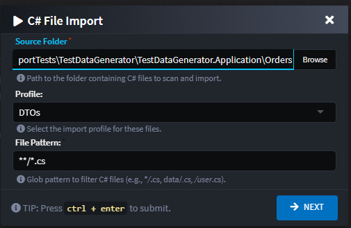
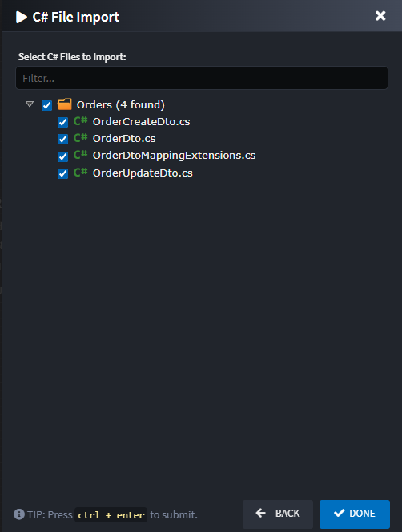

# Intent.CSharp.Importer

The C# importer adds a guided workflow to Intent Architect for pulling existing `.cs` files into Domain, and Services. The CSharp Importer Module makes it easier to integrate existing codebases by reverse-engineering model metadata directly from your C# source code.

## How it works

Invoke the importer from the designer that should receive the metadata:

- Right-click a Domain Package, Services Package, Eventing Package, or any folder inside those packages.
- Choose `Import from C# Files`.
- Complete the two-step wizard described below and finish the dialog to run the import.

The importer analyses the selected C# files, keeps track of external references so that re-running the import updates existing elements, and leaves untouched anything that is not re-imported (you can delete unused elements manually if required).

### 1. Configure Source and Import Settings

- **Source Folder**: Root directory that will be scanned for C# files. The importer uses this path to calculate the folder hierarchy to recreate inside the package.
- **Profile**: Determines which specializations are created. Available profiles depend on the designer and, for certain options, on installed modules (see *Profile catalogue* below). The dialog hides the selector if only one profile applies.
- **File Pattern**: Glob pattern (default `**/*.cs`) that filters the files discovered under the source folder. Examples: `src/**/*.cs`, `Models/*.cs`, `**/Dto*.cs`.
- **Target Folder**: When the wizard is launched from a folder, the importer automatically targets that folder; otherwise content is added at the package root.

### 2. Select Files to Import

- The importer builds a tree-view of folders and files that match the pattern. Entire folders can be selected to import all contained files; nodes are auto-selected by default to speed up bulk imports.
- You can deselect folders or individual files before continuing. Only the files you leave selected are analysed.
- The tree view uses full file paths internally, so repeat imports with the same files will reconcile by external reference rather than duplicating content.

## Profile catalogue

Different designers expose different profiles so that the importer can map Roslyn symbols onto the correct Intent specializations. Profiles may also declare dependencies so that supporting elements (for example DTOs referenced by services) are created automatically.

### Domain Designer

- **Classes** (`domain-classes`): Imports classes and records as Domain Entities. Public getters/setters become attributes, references to other imported classes turn into associations, and inheritance hierarchies are honoured.
- **Domain Events** (`domain-events`): Imports classes as Domain Events with event fields, inheritance, and supporting contracts (uses the Domain Contracts profile underneath).
- **Domain Contracts** (`domain-contracts`): Imports classes as Domain Data Contracts, mapping properties to fields while preserving hierarchy.
- **Enums Only** (`domain-enums`): Imports enums and their literals without creating class elements.

The Domain Events option only appears when the Domain Events designer module is installed.

### Services Designer

- **Services** (`services-services`): Imports classes and interfaces as Services or Service Contracts. Public methods become service operations, parameters become operation parameters, and referenced types trigger DTO imports.
- **DTOs** (`services-dtos`): Imports classes as DTOs, including inheritance and property collections.
- **Commands** (`services-commands`) and **Queries** (`services-queries`): Imports classes as CQRS Commands or Queries (visible when the Services CQRS module is installed). Both depend on the DTO profile for their payload types.
- **Enums Only** (`services-enums`): Imports enums without creating additional artifacts.

### Eventing Designer

- **Eventing Messages** (`eventing-integration-messages`): Imports classes as Eventing Messages with associated DTOs for message bodies.
- **Integration Commands** (`eventing-integration-commands`): Imports classes as integration commands, again relying on DTO support.
- **Integration DTOs** (`eventing-dtos`): Imports classes as integration DTOs.
- **Enums Only**: Reuses the Services enums profile for convenience.

## Import behaviour

- **Roslyn-powered analysis**: The importer parses the selected files with Roslyn, combining partial types and recognising classes, records, interfaces, and enums.
- **Folder scaffolding**: Package folders are created to mirror the relative paths beneath the selected source folder. Re-running the importer keeps these folders aligned.
- **Associations and dependencies**: When a property’s type matches another imported class, the importer builds associations between the corresponding elements. It also sets multiplicity and nullability by inspecting the property type (e.g. `ICollection<T>` leads to a collection association).
- **Inheritance**: Base classes, implemented interfaces, and interface hierarchies are preserved. The importer links inheritance using the relevant association settings for the chosen profile.
- **Constructors and methods**: For profiles that support them (for example services), constructors, methods, and their parameters are imported as child elements, including async flags, return types, and generic parameters.
- **Enums**: Enum types are imported with their literals. Literal values are carried across when explicitly assigned in code.
- **Type resolution**: Known primitive aliases (such as `string`, `Guid`, `DateTimeOffset`) resolve to the existing Intent type definitions. If a type cannot be found, the importer creates a `Type-Definition` placeholder so that you can replace or map it later.
- **Idempotent reruns**: Elements created from a file store an external reference (`Namespace.TypeName`). Re-running the importer keeps those elements in sync instead of duplicating them. Files that are no longer imported remain in the model until you remove them manually.

## Tips

- Start by importing DTOs (or other dependency-heavy types) so that service and event profiles have the structures they need. Alternatively, rely on the profile dependencies, which will scaffold required DTOs automatically.
- Use the glob pattern to exclude generated or test files that should not surface in Intent.
- After an import, review associations and type definitions—especially for heuristically created relationships—to ensure the Intent model reflects your intended design.
