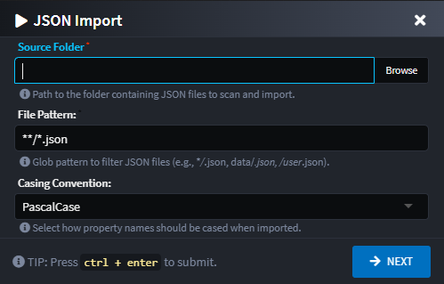
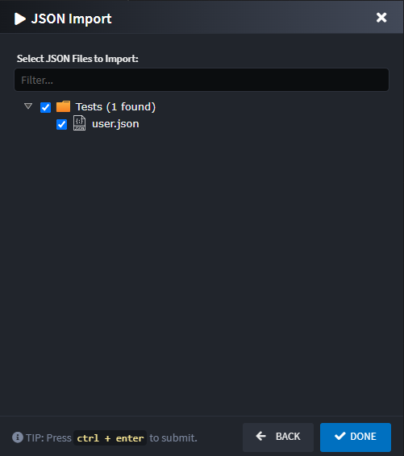
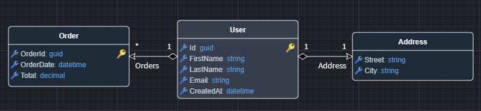
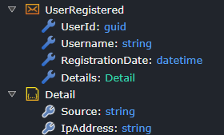
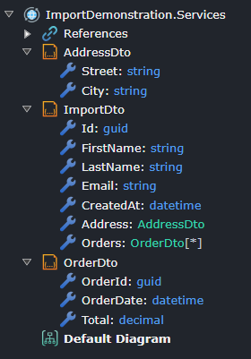

# Intent.Json.Importer

This module adds to Intent Architect the ability to import metadata from JSON files. For example, importing a set of JSON files to create a domain model.

## How it works

The importer is available on specific packages in the designers. Right-click on the package and select the `Import from JSON` context menu option.

The profile used for the import is determined by the type of package you right-click on:

- **Domain Designer**: Right-clicking on a `Domain Package` uses the `DomainDocumentDB` profile to import the JSON files as `Entities`.
- **Services Designer**: Right-clicking on an `Eventing Package` uses the `EventingMessages` profile to import the JSON files as `Messages`.
- **Services Designer**: Right-clicking on a `Services Package` uses the `ServicesDtos` profile to import the JSON files as `DTOs`.



Selecting this option will provide you with the following dialog:



The wizard has two steps:

### 1. Configure Source and Import Settings

This screen captures the location of your JSON files and how they should be interpreted.

#### Source Folder
The root folder where your JSON files are located. The importer will scan this folder and its subdirectories.

#### File Pattern
A glob pattern to filter which files are considered for import. Defaults to `**/*.json`.
*Examples:*
- `**/*.json`: All files with a `.json` extension in the source folder and all subfolders.
- `data/*.json`: Only `.json` files in the `data` subfolder.
- `**/user*.json`: Any `.json` file starting with `user` in any subfolder.

#### Casing Convention
This setting controls the casing of created elements and their attributes.

- **As Is**: Uses the casing directly from the JSON file properties.
- **PascalCase**: Converts element and attribute names to `PascalCase`.

### 2. Select Files to Import

After configuring the source, the next screen allows you to select which of the discovered files you wish to import.

A tree view displays all the files and folders that match the `File Pattern` from the previous step. You can select individual files or entire folders to be included in the import.

## JSON File Structure

The structure of the JSON files depends on the selected `Profile`.

Note: Each file must contain a single top-level JSON object. Top-level arrays or primitives are not supported.

Type inference rules used by the importer:
- Strings are imported as string unless the value is the sentinel token "guid" or "datetime", which infer Guid and DateTime respectively.
- Numbers are imported as decimal.
- Booleans are imported as bool.
- Null/undefined values are treated as unknown and default to object.
- Arrays infer their element type from the first element; empty arrays default to object[].
- Arrays of arrays are not supported.

### `DomainDocumentDB` Profile

Operating in a DocumentDB technology stack (CosmosDB, MongoDB, etc.) and wanting to import JSON elements into the domain designer, use the `DomainDocumentDB` profile.

Each `.json` file is treated as a definition for a `Entity` in the `Domain Designer`. The filename (without the extension) is used as the name of the `Entity`. The JSON object's properties are imported as `Attributes` on that `Entity`.

Nested JSON objects will be modeled as separate `Entities` with composite (has-a) relationships between them. Arrays of objects will result in a composite relationship with a `many` cardinality.

**Example `user.json`:**

This file will create a `User` entity with attributes like `id`, `firstName`, `lastName`, `email`, and `createdAt`. It will also create an `Address` entity and an `Order` entity and establish composite relationships from the `User` entity to them. The values `"guid"` and `"datetime"` are sentinel tokens used to infer `Guid` and `DateTime` types.

```json
{
  "id": "guid",
  "firstName": "John",
  "lastName": "Doe",
  "email": "john.doe@example.com",
  "createdAt": "datetime",
  "address": {
    "street": "123 Main St",
    "city": "Anytown"
  },
  "orders": [
    {
      "orderId": "guid",
      "orderDate": "datetime",
      "total": 99.99
    }
  ]
}
```

Diagram representation:



### `EventingMessages` Profile

When using the `EventingMessages` profile, each `.json` file is treated as a `Message` in the `Services Designer`. The filename (without the extension) is used as the name of the `Message`. Nested objects are created as `Eventing DTOs` and linked to the message.

**Example `user-registered.json`:**

This file will create a `UserRegistered` message with `userId`, `username`, and `registrationDate` properties. It will also create a `RegistrationDetails` DTO with a `source` property and associate it with the message. The values `"guid"` and `"datetime"` are sentinel tokens used to infer `Guid` and `DateTime` types.

```json
{
  "userId": "guid",
  "username": "john.doe",
  "registrationDate": "datetime",
  "details": {
    "source": "WebApp",
    "ipAddress": "192.168.1.100"
  }
}
```

Tree-view representation:



### `ServicesDtos` Profile

When using the `ServicesDtos` profile, each `.json` file is treated as a `DTO` in the `Services Designer`. The filename (without the extension) is suffixed with `Dto` to create the DTO name. Nested objects are created as separate `DTOs` and referenced via `DTO-Field` elements with appropriate collection modifiers for arrays.

**Example `user.json`:**

This file will create a `UserDto` with fields like `id`, `firstName`, `lastName`, and `email`. It will also create an `AddressDto` and an `OrderDto`, and establish references from the `UserDto` to them. Arrays are handled with collection modifiers on the field references. The values `"guid"` and `"datetime"` are sentinel tokens used to infer `Guid` and `DateTime` types.

```json
{
  "id": "guid",
  "firstName": "John",
  "lastName": "Doe",
  "email": "john.doe@example.com",
  "createdAt": "datetime",
  "address": {
    "street": "123 Main St",
    "city": "Anytown"
  },
  "orders": [
    {
      "orderId": "guid",
      "orderDate": "datetime",
      "total": 99.99
    }
  ]
}
```

Tree-view representation:


