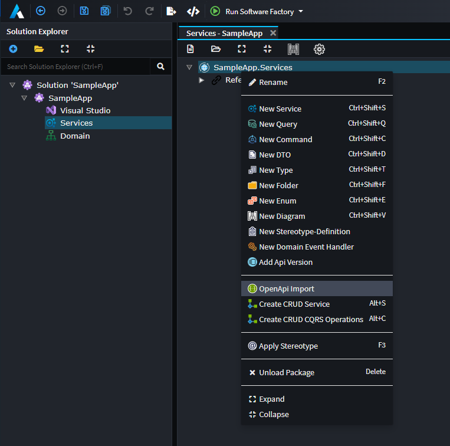

# Intent.OpenApi.Importer

This module enhances the `Service Designer` allowing you to import / reverse engineer service models from OpenApi documents.

## Service Designer

In the `Service Designer`, right click on your service package (or a folder in the package) and select the `OpenApi Import` context menu option.

Selecting this option will provide you with the following dialog:

### Dialog options

#### OpenApiFile

File path to the OpenApi document to import. This can be a path to the document stored locally (e.g. `C:\Dev\swagger-sample.json`) OR a URL to the document (e.g. `https://petstore.swagger.io/v2/swagger.json`)

> [!NOTE]
>
> This document needs to be at least version 3.x, if you are working with an older version document you can potentially use tools like `https://editor.swagger.io/` to upgrade older format files to the new standard.

The importer allows for `"` around the file name, these are not required. The Windows `Copy as Path` feature puts `"` around the file name so we support this for ease of use.

#### Service Paradigm

Select the paradigm you want the service modelled in:

- CQRS
- Traditional service

#### Allow Removal

The importer tracks what data it has imported, if this setting is enabled, the importer will remove any previously imported data.

#### Add Postfixes

If this option is on, it adds the relevant postfixes to your imported services, if they are not present. The postfixes are:

- Command
- Query
- Service

For example if you had a service end point named CreateCustomer and you select CQRS paradigm, the command will be named `CreateCustomerCommand` rather than simply `CreateCustomer`.

#### Persist Settings

The dialog can remember your configuration for the next time you want to run it. If you choose to persist the settings, they are saved in the `Services Package` which is committed in your source code repository.

- `(None)`,  settings will not be persisted and remembered. Previously saved configuration will be deleted.
- `All`, All settings will be persisted.
