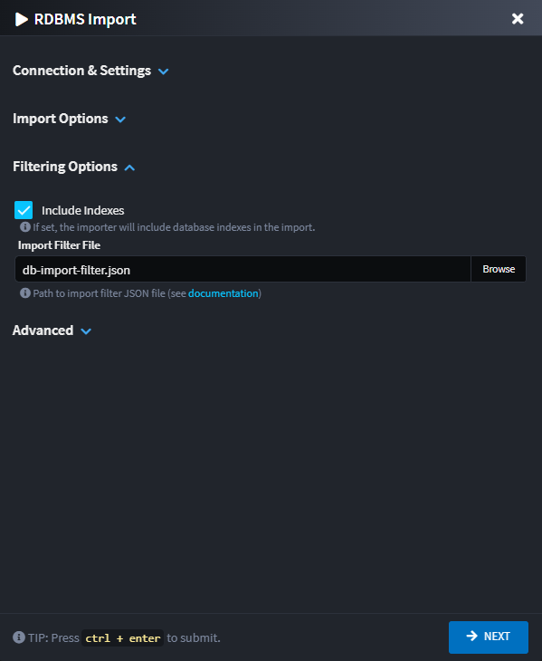

# Intent.Rdbms.Importer

This module adds to the Domain Designer the ability to import / reverse engineer domain models from relational databases such as SQL Server and PostgreSQL.

## Domain Designer

In the `Domain Designer`, right-click on your domain package and select the `Database Import` context menu option.


Selecting this option will provide you with the following dialog:


The dialog is organized into collapsible sections for a better user experience:

### Connection & Settings Section

#### Connection String

The connection string for the database you wish to import. Supports both SQL Server and PostgreSQL databases.

#### Test Connection

A button to validate that the connection string is valid and can successfully connect to the database server before proceeding with the import.

#### Persist Settings

The dialog can remember your configuration for the next time you want to run it. If you choose to persist the settings, they are saved in the `Domain Package` which is committed in your source code repository.
If you have any concerns around committing connection string in your code base, use the relevant option to avoid this.

- **(None)** - settings will not be persisted and remembered. Previously saved configuration will be deleted.
- **(with Sanitized connection string, no password)** - All settings will be persisted, if the connection string has a password in it, the password will not be persisted.
- **All (without connection string)** - All settings, except for the connection string, will be persisted.
- **All** - All settings will be persisted.

### Import Options Section


#### Entity name convention

The setting controls the naming convention of the entities which will be created in the Domain Designer.

- **Singularized table name** - Entity names will be the SQL table names, singularized. e.g. `Customers` -> `Customer`.
- **Table name, as is** - Entity names will be the SQL table names as is.

#### Apply table stereotypes

The setting controls under which conditions Table stereotypes are applied to the Entities. Tables stereotypes use to specify the underlying SQL Table name.
Sometimes Entity names may not be directly translatable back to the original table name due to differences in allowable character sets.

- **If They Differ** - Only introduce Table stereotypes if the Entity name does not translate back to the original table name.
- **Always** - Always add explicit tables names.

#### Stored Procedure Representations

Choose between using Repository Elements and Repository Operations to represent your Stored Procedures.

- **(Default)** - Use the default representation setting.
- **Stored Procedure Element** - Represent as dedicated elements.

  

- **Stored Procedure Operation** - Represent as repository operations.

  

### Filtering Options Section

#### Include Types

Select which SQL Types you would like to export:

- **Include Tables** - Export SQL tables.
- **Include Views** - Export SQL views.
- **Include Stored Procedures** - Export SQL stored procedures.
- **Include Indexes** - Export SQL indexes.

#### Import filter file



Specify a JSON file path **(that may be relative file path to the Package file being imported into)** with a file browser dialog that assists with importing only certain objects from SQL Server.

The import filter JSON file will be automatically updated with settings chosen on the RDBMS wizard dialogue.

For details on the format of this file, refer to the [Filter File Structure](#filter-file-structure) section of this document.

### Import selection screen

After pressing the `NEXT` button the next screen of the wizard will show a loader as the RDBMS is queried and then show allows you to interactively select which database objects (tables, views, stored procedures) to include or exclude from the import process through a hierarchical tree view. This provides an intuitive way to create and manage filter files without manually editing JSON.


#### Filter Type

- **Exclude Selected** - All items _except_ those selected in the below tree view will be imported.
- **Include Selected** - _Only_ the items selected in the below tree view will be imported.

#### Include Dependent Tables

When checked the importer will automatically also import dependent tables of those that were select, e.g. a table on which a selected table has a foreign key constraint on.

#### Objects to Exclude/Include from/in Import

A tree view of database objects which can be checked to specify if the should be included or excluded depending on the [Filter Type](#filter-type) option selected above.

The filter box can be used to filter the items visible on the tree view which can be useful in cases where there are many database objects.

### Filter file structure

The filter file should follow this JSON structure:

```json
{
  "schemas": [
    "dbo"
  ],
  "include_dependant_tables": true,
  "include_tables": [
    {
      "name": "ExistingTableName",
      "exclude_columns": [
        "LegacyColumn"
      ]
    }
  ],
  "include_views": [
    {
      "name": "ExistingViewName",
      "exclude_columns": [
        "LegacyColumn"
      ]
    }
  ],
  "include_stored_procedures": [
    "ExistingStoredProcedureName"
  ],
  "exclude_tables": [
    "LegacyTableName"
  ],
  "exclude_views": [
    "LegacyViewName"
  ],
  "exclude_stored_procedures": [
    "LegacyStoredProcedureName"
  ],
  "exclude_table_columns" : [
    "LegacyGlobalColumn"
  ],
  "exclude_view_columns" : [
    "LegacyGlobalColumn"
  ]
}
```

| JSON Field                | Description |
|---------------------------|-------------|
| schemas                   | Database Schema names to import. If empty, all schemas are imported. If specified, only these schemas are imported. |
| include_dependant_tables  | Determines whether foreign key dependant tables of included tables are automatically included (default: `false`). All dependant tables will be included, unless explicitly excluded by `exclude_tables`. |
| include_tables            | Database Tables to import. If empty, all tables are imported. If specified, only these tables are imported. Tables can be specified by name or schema.name format. Each table can have specific columns excluded. |
| include_views             | Database Views to import. If empty, all views are imported. If specified, only these views are imported. Views can be specified by name or schema.name format. Each view can have specific columns excluded. |
| include_stored_procedures | Database Stored Procedures to import. If empty, all stored procedures are imported. If specified, only these stored procedures are imported. Can be specified by name or schema.name format. |
| exclude_tables            | Database Tables to exclude from import. Include settings take precedence over exclude settings if the same name is found. |
| exclude_views             | Database Views to exclude from import. Include settings take precedence over exclude settings if the same name is found. |
| exclude_stored_procedures | Database Stored Procedures to exclude from import. Include settings take precedence over exclude settings if the same name is found. |
| exclude_table_columns     | A list of column names that should be excluded from import if they are found in any table during the import process. |
| exclude_view_columns      | A list of column names that should be excluded from import if they are found in any view during the import process. |

## Trigger imports

By default, if a qualifying table has a trigger, it will be imported and modeled as follows:


> [!NOTE]  
> The actual `trigger` implementation is not modeled in the `Domain Designer`. The `trigger` stereotype is used only to mark to the underlying provider (specifically, Entity Framework Core) that the table has an existing trigger. This allows Entity Framework to correctly generate the appropriate SQL statements.
