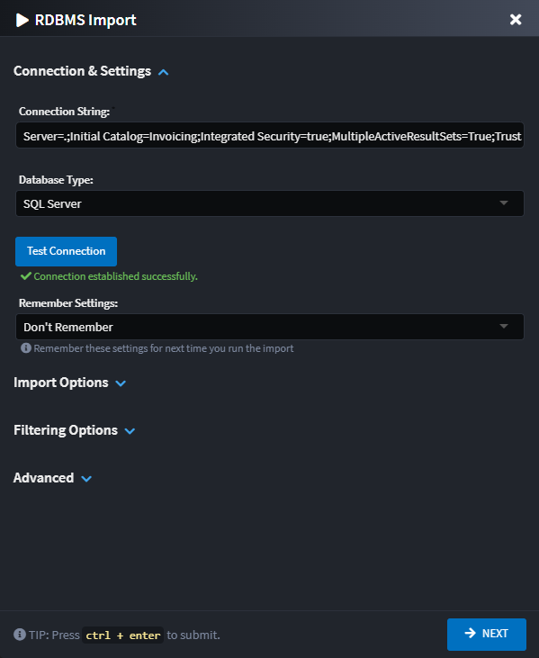
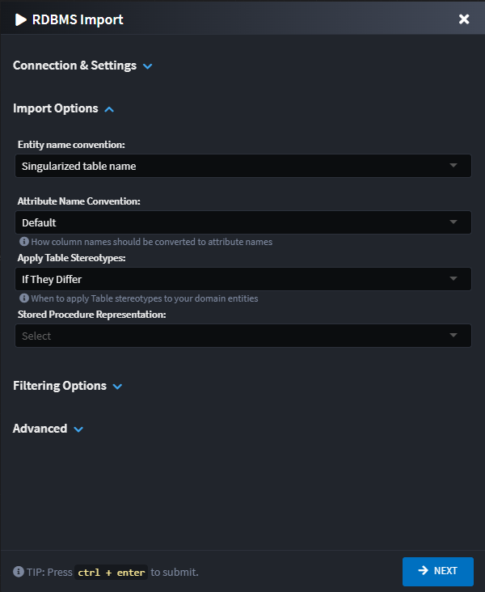

# Intent.Rdbms.Importer

This module adds to the Domain Designer the ability to import / reverse engineer domain models from relational databases such as SQL Server and PostgreSQL.

## Domain Designer

In the `Domain Designer`, right-click on your domain package and select the `Database Import` context menu option.


Selecting this option will provide you with the following dialog:



The dialog is organized into collapsible sections for a better user experience:

### Connection & Settings Section

#### Connection String

The connection string for the database you wish to import. Supports both SQL Server and PostgreSQL databases.

#### Test Connection

A button to validate that the connection string is valid and can successfully connect to the database server before proceeding with the import.

#### Database Type

Select the type of database you're connecting to:

- **SQL Server** - Microsoft SQL Server databases.
- **PostgreSQL** - PostgreSQL databases.

#### Remember Settings

The dialog can remember your configuration for the next time you want to run it. If you choose to persist the settings, they are saved in the `Domain Package` which is committed in your source code repository.
If you have any concerns around committing connection string in your code base, use the relevant option to avoid this.

- **Don't Remember** - Settings will not be persisted and remembered. Previously saved configuration will be deleted.
- **All (with Sanitized connection string, no password)** - All settings will be persisted. If the connection string has a password in it, the password will not be persisted.
- **All (without connection string)** - All settings, except for the connection string, will be persisted.
- **All Settings** - All settings will be persisted.

### Import Options Section



#### Entity Name Convention

This setting controls the naming convention of the entities which will be created in the Domain Designer.

- **Singularized table name** - Entity names will be the SQL table names, singularized. e.g. `Customers` -> `Customer`.
- **Table name, as is** - Entity names will be the SQL table names as is. e.g. `tblColor` -> `tblColor`.

#### Attribute Name Convention

This setting controls how database column names are converted to attribute names in the Domain Designer.

- **Default** - Column names will be converted to PascalCase format. e.g. `FIRST_NAME` -> `FirstName`.
- **Column name, as-is** - Attribute names will match the column names exactly as they appear in the database. e.g. `FIRST_NAME` -> `FIRST_NAME`.

#### Apply Table Stereotypes

This setting controls under which conditions Table stereotypes are applied to the Entities. Table stereotypes are used to specify the underlying SQL Table name.
Sometimes Entity names may not be directly translatable back to the original table name due to differences in allowable character sets.

- **If They Differ** - Only introduce Table stereotypes if the Entity name does not translate back to the original table name.
- **Always** - Always add explicit table names.

#### Stored Procedure Representations

Choose between using Repository Elements and Repository Operations to represent your Stored Procedures.

- **(Default)** - Use the default representation setting.
- **Stored Procedure Element** - Represent as dedicated elements.

  

- **Stored Procedure Operation** - Represent as repository operations.

  

### Filtering Options Section

#### Include Indexes

When checked, the importer will include database indexes in the import. Indexes are represented as stereotypes on the domain entities and their attributes.

#### Import Filter File


Specify a JSON file path **(that may be a relative file path to the Package file being imported into)** with a file browser dialog that assists with importing only certain objects from the database.

The import filter JSON file will be automatically updated with settings chosen on the RDBMS wizard dialogue.

For details on the format of this file, refer to the [Filter File Structure](#filter-file-structure) section of this document.

### Advanced Section

The Advanced section contains options for fine-tuning the import behavior:

#### Remove Deleted Database Attributes and Associations

When checked, the importer will remove attributes and associations from your domain model that no longer exist in the database. This helps keep your domain model synchronized with the database schema.

- **Enabled** (default) - Attributes and associations that no longer exist in the database will be removed during import.
- **Disabled** - Existing attributes and associations will be preserved even if they no longer exist in the database.

#### Preserve User-Specified Attribute Types

When checked, the importer will preserve any attribute types that you have manually changed in the domain model, preventing them from being overwritten by the database schema types.

- **Enabled** (default) - Manually specified attribute types will be preserved during import. A warning will be logged when the database type differs from the preserved type.
- **Disabled** - Attribute types will always be updated to match the database schema.

> [!NOTE]
> When "Preserve User-Specified Attribute Types" is enabled and a type change is detected, a warning will be displayed in the import output indicating which attributes were preserved and what the database type would have changed them to.

### Import Selection Screen

After pressing the `NEXT` button, the next screen of the wizard will show a loader as the database is queried and then allow you to interactively select which database objects (tables, views, stored procedures) to include or exclude from the import process through a hierarchical tree view. This provides an intuitive way to create and manage filter files without manually editing JSON.


#### Filter Type

Choose how the selection tree should be interpreted:

- **Include Selected** - _Only_ the items selected in the tree view below will be imported.
- **Exclude Selected** - All items _except_ those selected in the tree view below will be imported.

#### Include Dependent Tables

When checked, the importer will automatically also import dependent tables of those that were selected, e.g. a table on which a selected table has a foreign key constraint.

#### Objects to Exclude/Include from/in Import

A tree view of database objects organized by schema, with separate categories for:

- **Tables** - Database tables
- **Views** - Database views  
- **Stored Procedures** - Database stored procedures

Items can be checked to specify whether they should be included or excluded depending on the [Filter Type](#filter-type) option selected above.

The filter box can be used to search and filter the items visible in the tree view, which is particularly useful when dealing with databases that have many objects.

### Filter File Structure

The filter file is a JSON file that provides fine-grained control over what gets imported from the database. While the visual selection tree in the wizard provides an easy way to configure filters, you can also manually create or edit these files.

The filter file should follow this JSON structure:

```json
{
  "filter_type": "include",
  "schemas": [
    "dbo"
  ],
  "include_dependant_tables": true,
  "include_tables": [
    {
      "name": "dbo.ExistingTableName",
      "exclude_columns": [
        "LegacyColumn"
      ]
    }
  ],
  "include_views": [
    {
      "name": "dbo.ExistingViewName",
      "exclude_columns": [
        "LegacyColumn"
      ]
    }
  ],
  "include_stored_procedures": [
    "dbo.ExistingStoredProcedureName"
  ],
  "exclude_tables": [
    "dbo.LegacyTableName"
  ],
  "exclude_views": [
    "dbo.LegacyViewName"
  ],
  "exclude_stored_procedures": [
    "dbo.LegacyStoredProcedureName"
  ],
  "exclude_table_columns" : [
    "LegacyGlobalColumn"
  ],
  "exclude_view_columns" : [
    "LegacyGlobalColumn"
  ]
}
```

#### Filter File Fields

| JSON Field                | Description |
|---------------------------|-------------|
| `filter_type`             | Specifies how the filter should be applied. Valid values: `"include"` (only import selected items) or `"exclude"` (import everything except selected items). Default: `"include"`. |
| `schemas`                 | Database schema names to import. If empty, all schemas are imported. If specified, only these schemas are imported. |
| `include_dependant_tables`| Determines whether foreign key dependent tables of included tables are automatically included (default: `false`). All dependent tables will be included, unless explicitly excluded by `exclude_tables`. |
| `include_tables`          | Database tables to import. If empty, all tables are imported. If specified, only these tables are imported. Tables should be specified in `schema.name` format. Each table can have specific columns excluded. |
| `include_views`           | Database views to import. If empty, all views are imported. If specified, only these views are imported. Views should be specified in `schema.name` format. Each view can have specific columns excluded. |
| `include_stored_procedures` | Database stored procedures to import. If empty, all stored procedures are imported. If specified, only these stored procedures are imported. Should be specified in `schema.name` format. |
| `exclude_tables`          | Database tables to exclude from import. Include settings take precedence over exclude settings if the same item is found. Should be specified in `schema.name` format. |
| `exclude_views`           | Database views to exclude from import. Include settings take precedence over exclude settings if the same item is found. Should be specified in `schema.name` format. |
| `exclude_stored_procedures` | Database stored procedures to exclude from import. Include settings take precedence over exclude settings if the same item is found. Should be specified in `schema.name` format. |
| `exclude_table_columns`   | A list of column names that should be excluded from import if they are found in any table during the import process. Useful for globally excluding audit columns like `CreatedBy`, `ModifiedDate`, etc. |
| `exclude_view_columns`    | A list of column names that should be excluded from import if they are found in any view during the import process. |

> [!TIP]
> The wizard's visual selection tree automatically manages the filter file for you. Any selections made in the tree view are saved to the specified filter file when you complete the wizard.

## Trigger imports

By default, if a qualifying table has a trigger, it will be imported and modeled as follows:


> [!NOTE]  
> The actual `trigger` implementation is not modeled in the `Domain Designer`. The `trigger` stereotype is used only to mark to the underlying provider (specifically, Entity Framework Core) that the table has an existing trigger. This allows Entity Framework to correctly generate the appropriate SQL statements.
